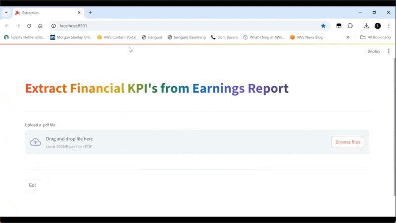

# Amazon-Bedrock-Text-Extraction-POC
This is sample code demonstrating the use of Amazon Bedrock and Generative AI to extract text from a document. The application is constructed with a simple streamlit frontend where users leverage Bedrock Agents to extract and summarize key information from a document like a financial earnings report. 

Authored by: Al Destefano and Dom Bavaro
<!-- Need updated gif here -->

# **Goal of this Repo:**
The goal of this repo is to provide users with a simple text extraction POC. The example document leveraged is an Amazon Earnings Report and the Agents will extract key information: Report Title, Report Publishing Date, Company Focus, Earnings Per Share (EPS), Net Income, Free Cash Flow, Brief Summary of Report, and a Key Quote from Leadership. This is just one example of text extraction and the prompts can be altered depending on the type of document and information you would like extracted. 

The architecture and flow of the sample application will be:


The application flow is as follows:

1. The user uploads a document to be summarized, in this example we use an earnings report in PDF format into the streamlit app. (app.py).
2. The streamlit app, takes the PDF and passes it into Amazon Bedrock. If you upload another document make sure to update your prompts with what you want extracted/summarized! (extract_pdf_to_json.py).
3. A Bedrock Agent extracts key information and returns it to the user in valid JSON format. (extract_pdf_to_json.py).

# How to use this Repo:

## Prerequisites:

1. Amazon Bedrock Access and CLI Credentials. Ensure that the proper FM model access is provided in the Amazon Bedrock console.
2. Ensure Python 3.10 installed on your machine, it is the most stable version of Python for the packages we will be using, it can be downloaded [here](https://www.python.org/downloads/release/python-3911/).

## Step 1:
The first step of utilizing this repo is performing a git clone of the repository.

```
https://github.com/aws-samples/genai-quickstart-pocs.git
```

After cloning the repo onto your local machine, open it up in your favorite code editor. The file structure of this repo is broken into 3 key files,
the app.py file, the extract_pdf_to_json.py.py file and the AMZN-Q1-2024-Earnings-Release.pdf. The app.py file houses the frontend application (a streamlit app). 
The extract_pdf_to_json.py.py file houses the setup of an Amazon Bedrock Agent and the basic prompt formatting logic.
The AMZN-Q1-2024-Earnings-Release.pdf file contains an example earnings report the user will upload.

## Step 2:
Set up a python virtual environment in the root directory of the repository and ensure that you are using Python 3.9. This can be done by running the following commands:
```
pip install virtualenv
python3.10 -m venv venv
```
The virtual environment will be extremely useful when you begin installing the requirements. If you need more clarification on the creation of the virtual environment please refer to this [blog](https://www.freecodecamp.org/news/how-to-setup-virtual-environments-in-python/).
After the virtual environment is created, ensure that it is activated, following the activation steps of the virtual environment tool you are using. Likely:
```
load_dotenv()
```

## Step 3:
Now that the requirements have been successfully installed in your virtual environment we can begin configuring environment variables.
You will first need to create a .env file in the root of this repo. Within the .env file you just created you will need to configure the .env to contain:

```
boto3.setup_default_session(profile_name=os.getenv('profile_name'))
```
Please ensure that your AWS CLI Profile has access to Amazon Bedrock! Next you will setup the Bedrock client: 

```
config = botocore.config.Config(connect_timeout=300, read_timeout=300)
bedrock = boto3.client('bedrock-runtime' , 'us-east-1', config = config)
```

## Step 4:
As soon as you have successfully cloned the repo, created a virtual environment, activated it, installed the requirements, and created the .env file, your application should be ready to go. 
To start up the application with its basic frontend you simply need to run the following command in your terminal while in the root of the repositories' directory:

```
streamlit run app.py
```
As soon as the application is up and running in your browser of choice you can upload the earnings report (or any other document) and have Amazon Bedrock begin summarizing the document information. 
